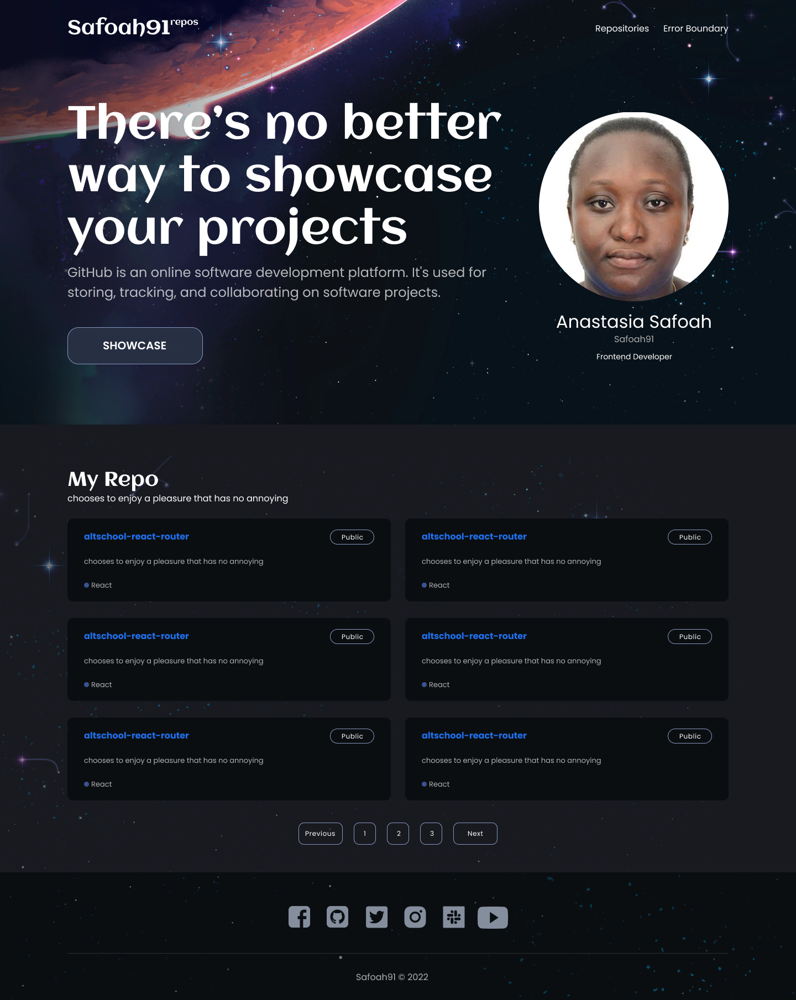
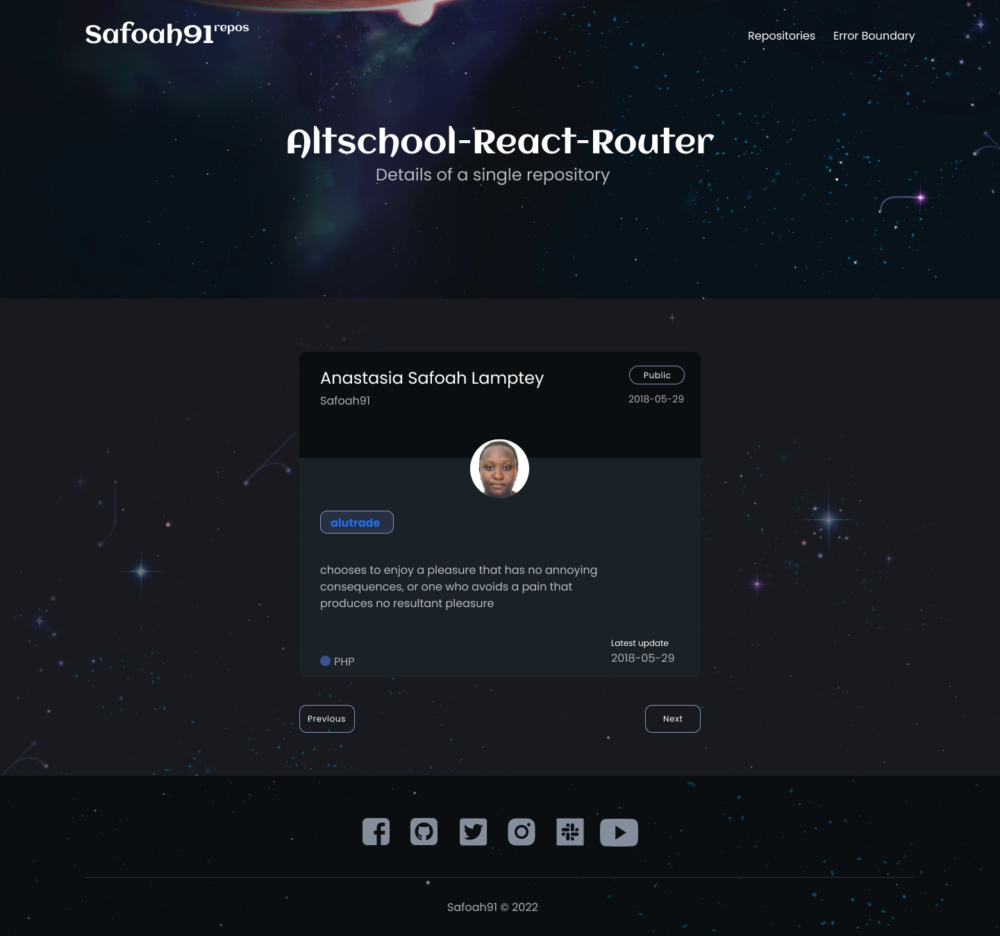
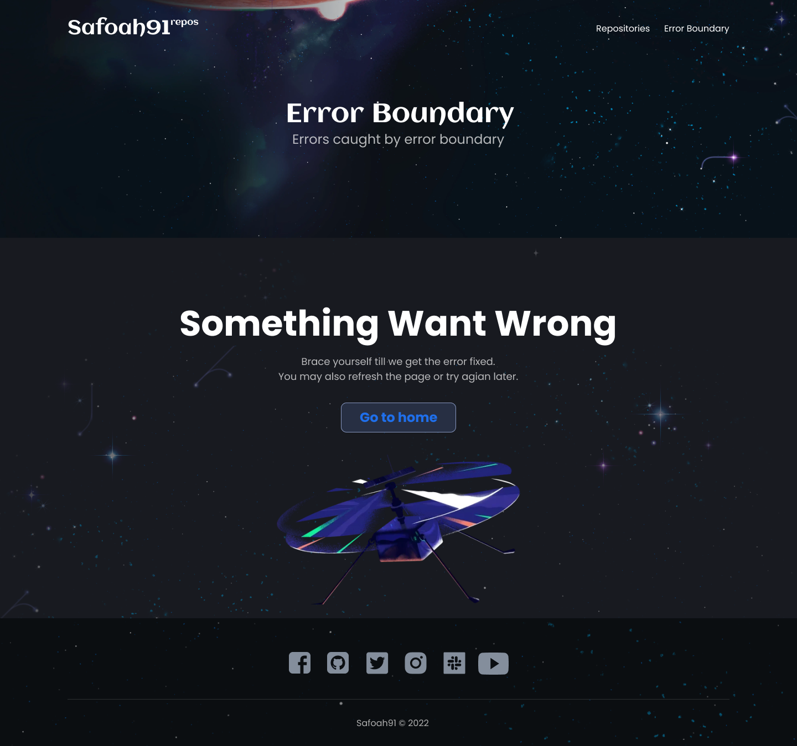
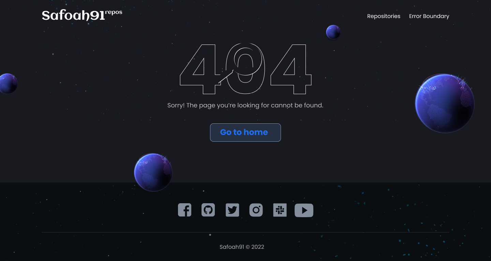

# Project to display all my repository
Implement an API fetch of your GitHub portfolio, show a page with a list of all your repositories on GitHub(the page should implement pagination for the repo list), and create another page showing data for a single repo clicked from the list of repos using nested routes while using all the necessary tools in react. Implement the proper SEO, Error Boundary (show a page to test the error boundary) and 404 pages. Good UI and Designs are important. 

## Repos URLs
Click to see [my repos](https://github.com/safoah91)
Click to see [my repos api](https://api.github.com/users/safoah91)

## Screens

#### Home

#### Single Repository

#### Error Boundary

#### Page Note Found - 404

## Todos

- [x] **Structure project and remove unneccesory file/folder**
  - [x] **Create components directory with the following pages**
    - [x] Helmet (to setup SEO)
    - [x] Home (to display all repos)
    - [x] Repo (to display a particular repo)
    - [x] PageNotFound (display page not found - 404)
    - [x] ErrorBoundary (test error boundary)
    - [x] Navbar (setup navigations)
    - [x] Footer (display footer on each page)
- [x] **Install packages**
  - [x] [Helmet](https://www.javatpoint.com/react-helmet) (setup SEO) `npm i --save react-helmet`
  - [x] [react-router-dom](https://v5.reactrouter.com/web/guides/quick-start) (setup Rounters) `npm i react-router-dom@6`
  - [x] [axios](https://axios-http.com/docs/intro) (fetch data from an endpoint) `npm i axios`
  - [x] [react-paginate](https://github.com/AdeleD/react-paginate) (setup pagination) `npm i reac`
  - [x] [react-icons](https://react-icons.github.io/react-icons/) (setup icons) `npm i react-icons`
- [x] **Setup Routes and Navigations in:**
  - [x] index.js
  - [x] NavBar.jsx
  - [x] App.js
- [x] **Develop Helmet page**
- [x] **Develop Nav, Footer, Home page**
  - [x] *Fetch repos and populate with the following details:*
    - [x] id
    - [x] avatar
    - [x] Repo name
    - [x] Main language
  - [x] Button to a single page repo
- [x] **Develop Repo page**
  - [x] *Display more detail about Repo:*
    - [x] avatar
    - [x] Repo name
    - [x] Description
    - [x] Main language
    - [x] Created at
    - [x] Latest Update
    - [x] Visibility
    - [x] Repo URL
- [x] **Develop PageNoteFound - 404**
- [x] **Develop ErrorBoundary page**

## Available Scripts

In the project directory, you can run:

### `npm start`

Runs the app in the development mode.\
Open [http://localhost:3000](http://localhost:3000) to view it in your browser.

The page will reload when you make changes.\
You may also see any lint errors in the console.

### `npm test`

Launches the test runner in the interactive watch mode.\
See the section about [running tests](https://facebook.github.io/create-react-app/docs/running-tests) for more information.

### `npm run build`

Builds the app for production to the `build` folder.\
It correctly bundles React in production mode and optimizes the build for the best performance.

The build is minified and the filenames include the hashes.\
Your app is ready to be deployed!

See the section about [deployment](https://facebook.github.io/create-react-app/docs/deployment) for more information.

### `npm run eject`

**Note: this is a one-way operation. Once you `eject`, you can't go back!**

If you aren't satisfied with the build tool and configuration choices, you can `eject` at any time. This command will remove the single build dependency from your project.

Instead, it will copy all the configuration files and the transitive dependencies (webpack, Babel, ESLint, etc) right into your project so you have full control over them. All of the commands except `eject` will still work, but they will point to the copied scripts so you can tweak them. At this point you're on your own.

You don't have to ever use `eject`. The curated feature set is suitable for small and middle deployments, and you shouldn't feel obligated to use this feature. However we understand that this tool wouldn't be useful if you couldn't customize it when you are ready for it.

### Deployment

This section has moved here: [https://altschool-safoah91-repos.netlify.app/](https://altschool-safoah91-repos.netlify.app/)
